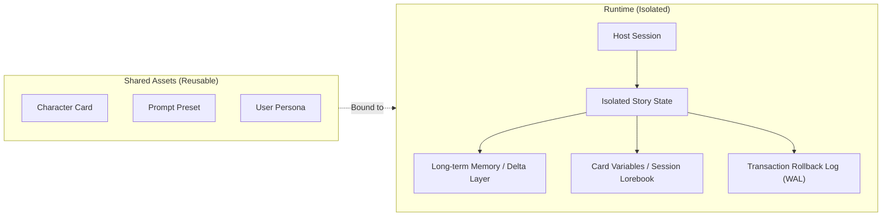

<div align="center">

# dsh-liketavern

**Tavern-style roleplay in DeepSeek Harness's `dsh web`, with character cards, lorebooks, and long-term memory.**

[](https://github.com/Amakurai/dsh-liketavern/releases/tag/v0.4.0)
[](https://deepseek-harness.github.io/deepseek-harness/)
[](https://nodejs.org/)
[](./LICENSE)

[中文](./README.md) | English

[Features](#features) · [Key concepts](#key-concepts) · [Installation & upgrade](#installation--upgrade) · [Getting started](#getting-started) · [Everyday use](#everyday-use)

[Compatibility](#compatibility) · [Data & backups](#data--backups) · [FAQ & diagnostics](#faq--diagnostics) · [Documentation](#documentation) · [Development & debugging](#development--debugging) · [Contributing](#contributing)

</div>

---

**dsh-liketavern** is a dedicated roleplay plugin for [DeepSeek Harness](https://github.com/deepseek-ai/deepseek-harness) (`dsh`). It enables you to directly import SillyTavern (ST) character cards and prompt presets, manage settings, advance storylines, branch dialogues, and perform lossless state rollbacks inside dsh's native agent runtime.

- **Host responsibility**: Model connectivity, long-context chat history, tool execution, and Agent runtime.
- **Plugin responsibility**: Character asset management, ST preset & prompt assembly, isolated story state (memory / delta layer / variables), and sandboxed interactive cards & scripts.
- **Out of the box**: Built-in EJS prompt template engine, Tavern Helper API subset, native MVU support; interface language automatically follows the host.

> 💡 **First time here?** Start with [Requirements & installation](#installation--upgrade) and follow the [5-step quick start](#getting-started). When migrating existing ST assets, check [Key concepts](#key-concepts) and [Compatibility](#compatibility).

---

## Features

| Area | Capabilities & Highlights |
| :--- | :--- |
| **🎭 Character Cards & Personas** | • Import/export V1, V2, and V3 PNG and JSON character cards<br>• Multiple greetings, embedded lorebooks, card regex, and interactive HTML cards<br>• Recoverable archive bin and reference-protected permanent deletion; personas provide global/session `{{user}}` identity definitions |
| **📖 Lorebooks & World State** | • Three-tiered lorebook hierarchy: Global, Character-specific, and Session-private<br>• Keyword activation (secondary keys, exclusions, logic AND/OR), constant entries, and recursive scanning<br>• Story Delta Layer tracks new, modified, and invalidated world facts across the story |
| **🧠 Intelligent Long-Term Memory** | • BM25 retrieval with time-decay weighting; model reads and writes autonomously during roleplay<br>• Background idle auto-summarization when capacity is exceeded, preserving verifiable source archives |
| **🌿 Story Branching & Safe Rollback** | • Regenerating, editing AI replies, or rolling back automatically forks an independent child session<br>• Automatically revokes uninherited memories and variables while leaving the original timeline intact |
| **⚡ EJS Template Engine** | • Secure isolated sandbox evaluation for conditions, loops, async macros, and decorators<br>• Supports story/message variables, JSON/YAML initializers, JSON Patch, Zod, Lodash, and Faker |
| **📦 Interactive Cards & Scripts** | • Strict iframe sandboxing with 3 script library scopes (Global / Preset / Character)<br>• Story variable persistence, same-page events, lorebook CRUD, and live message partial refresh |
| **🔄 Native MVU Support** | • Optional auto-initialization and post-reply variable update runner<br>• Failed tasks remain in a retry queue; compatible with status bar placeholders declared via display regex |
| **🛠️ Model Tools & Impersonation** | • 7 dedicated PTC tools (memory search/write/update, lorebook entry read, world-state update, asset list/read)<br>• Supports AI impersonation (generates user dialogue and copies to clipboard) and context continuation |

> 🧩 **Smart Tool Calling**: Ordinary roleplay replies directly and fluidly. The model calls tools only when key details are missing or established facts need to be persisted, keeping conversations immersive and consistent.

---

## Key Concepts

Understanding the relationship between assets and runtime state helps you make the most of the plugin:



| Term | Purpose & Distinction |
| :--- | :--- |
| **Tavern mode** | The dsh session preset that activates this plugin's roleplay Agent runtime. Select it when creating a new session. |
| **Prompt preset** | ST prompt template configurations managed under Tavern → Presets. Bind them to sessions or use the built-in default. |
| **Character vs Persona** | A **Character Card** defines who the AI plays; a **Persona** defines who you are and supplies `{{user}}` in prompts. |
| **Lorebook / Memory / World State** | **Lorebooks** supply background lore; **Memory** records narrative facts; **World State** tracks dynamic state changes in the world. |
| **Session vs Story Branch** | A **Session** stores linear chat messages; a **Story** holds plugin state (memories, variables, WAL). Regenerating forks a child session and an independent story. |
| **Native MVU** | Model-View-Update variable state framework. The plugin provides a safe native runner for data-driven cards. |

---

## Installation & Upgrade

### Requirements

| Component | Minimum Requirement | Notes |
| :--- | :--- | :--- |
| **Node.js** | `≥ 24.0.0` | Development and CI environments use Node 24 |
| **dsh CLI / Host** | **`0.1.7-rc.2`** | Peer dependencies are pinned to this host version |
| **pnpm** | Any modern version | Used by `dsh plugin` to resolve and install dependencies |
| **Model** | Configured in dsh | Ensure you can start an ordinary conversation in dsh |

> 📌 First time with dsh? Refer to the [DeepSeek Harness Documentation](https://deepseek-harness.github.io/deepseek-harness/) and run `dsh web` once to complete initialization.

---

### Option 1: Install via dsh plugin (Recommended)

Run these commands in your terminal to install the pinned stable release:

```bash
# 1. Add plugin to web profile
dsh plugin --profile web add github:Amakurai/dsh-liketavern#v0.4.0

# 2. Verify installation
dsh plugin --profile web list --depth 0

# 3. Launch dsh web (stop any running instance first)
dsh web
```

*Pre-compiled `lib/` bundles are included in this repository. No local TypeScript compilation is required for normal installation.*

---

### Option 2: Install from Release Tarball (Offline)

1. Download `dsh-liketavern-0.4.0.tgz` from the [v0.4.0 Release](https://github.com/Amakurai/dsh-liketavern/releases/tag/v0.4.0) (with `SHA256SUMS.txt` for integrity verification).
2. In the download directory, run:

```bash
dsh plugin --profile web add ./dsh-liketavern-0.4.0.tgz
dsh web
```

---

### Checking for Updates & Upgrading

- **In-App Check**: Open **Settings → Tavern → About** in dsh to view current versions and check for new GitHub releases.
- **Upgrade**: Review the [Changelog](./CHANGELOG.md), back up your data, run the new `dsh plugin add` command, and restart `dsh web`.
- Existing data directories are preserved seamlessly across upgrades (see [Data & backups](#data--backups)).

---

## Getting Started

Start your Tavern roleplay in 5 simple steps:

```text
  1. Import Card   ➔    2. New Session   ➔    3. Verify Setup   ➔    4. Start Chat   ➔    5. Explore Branches
 (PNG / JSON file)     (Select Tavern)       (Preset/Lorebooks)       (Pick Greeting)      (Retry/Edit/Impersonate)
```

1. **Prepare a Character Card**
   Go to **Settings → Tavern → Characters** and click **Import Character** to load a PNG or JSON card. Review the static compatibility report and save.
2. **Create a Story Session**
   Create a new session, choose **Tavern 模式** (Tavern Mode), and click your imported character card.
3. **Configure Session Settings**
   Click the **Character entry** at the top of the conversation to fine-tune the prompt preset, persona, or attached lorebooks for this story (defaults work out of the box).
4. **Choose a Greeting and Begin**
   If the card contains multiple greetings, use `‹ ›` to pick your opening scenario, click **Start chat**, and send your first message.
5. **Adjust & Explore Branches**
   Want to change the narrative direction? Use the actions on any AI reply:
   - 🔄 **Regenerate / ✏️ Edit**: Automatically forks a new child timeline branch. Switch between branches at any time using `‹ n/m ›`.
   - ⏩ **Continue**: Directs the AI to keep writing from where it left off.
   - 🎭 **AI Impersonation**: Asks the AI to compose the next user response (copied to your clipboard).

> 🔍 **Inspect Prompts**: After the first reply, click the top character entry and select **Prompt preview → Last request** to inspect the exact prompt structure sent to the model.

---

## Everyday Use

### Configuration Entry Points & Scope

| Task | Location | Scope & Behavior |
| :--- | :--- | :--- |
| **Global Asset Management** (Cards / Presets / Lorebooks / Personas) | `Settings → Tavern → Respective Pages` | **Global Shared Assets**: Changes apply to subsequent turns across all sessions using them |
| **Default Template for New Sessions** | `Settings → Tavern → Settings → Defaults` | **Global Defaults**: Applied when picking a character in a new session; existing sessions are unaffected |
| **Current Story Configuration** (Preset / Persona / Author's Note) | `Character control at top of chat` | **Current Session**: Changes apply to future turns in this story |
| **Story-Private Lorebook** | `Top character control → Edit session lorebook` | **Story Private**: Inherited and rolled back with branches; does not pollute global lorebooks |
| **View & Edit Long-term Memories** | `Top character control → Memory` or `Tavern → Memory` | **Selected Story**: Editing an active story takes effect immediately; "Initial state" affects only future stories |
| **Regex & Script Configuration** | `Tavern → Regex` / `Tavern → Settings → Scripts` | Applies to the selected scope (Global / Preset / Character) |
| **Prompt Assembly & Trigger Verification** | `Top character control → Prompt preview` | **Read-only**: Inspect current turn prompt layout and activated lorebook entries |

> 🌐 **Interface Language**: Follows dsh host locale by default (Chinese for zh-*, English otherwise). You can lock it to English or Chinese in Settings → Tavern → Interface → Language.

---

### Story Branching & Safe Rollback

Unlike standard linear chat, dsh-liketavern provides **fine-grained state snapshots and transaction rollback isolation**:

```text
[Main Timeline] ─── Turn 1 ─── Turn 2 (Obtained Key) ─── Turn 3 (Unlocked Door)
                                   │
                                   └── [Regenerate Turn 2] ─── Branch 2 (Key broke, memories rolled back)
```

- **Branch Safety**: When regenerating from Turn 2, the plugin creates an isolated child session and automatically revokes derived memories, world state, and variables after Turn 2.
- **Timeline Preservation**: The main timeline retains the "Obtained Key" fact, while Branch 2 develops independently with fresh state.
- **Editing AI Replies**: Similarly forks into a clean branch, revoking downstream facts and letting you continue seamlessly.

---

## Compatibility

### Third-Party Cards, Templates & Scripts

- **Tavern Helper Support**: Variables, script libraries, lorebook CRUD, and core message operations are supported. Advanced APIs (`generateRaw`, cross-tab broadcast) are in progressive adaptation. See [Tavern Helper Compatibility](https://github.com/Amakurai/dsh-liketavern/blob/main/docs/TAVERN_HELPER.md).
- **Built-in EJS Templates**: Full support for standard ST template expressions without extra extensions. See [Prompt Templates](https://github.com/Amakurai/dsh-liketavern/blob/main/docs/PROMPT_TEMPLATES.md).
- **Rendering & Markdown Security**: Uses `markdown-it` in place of vulnerable legacy formatters. HTML cards run in strict `sandbox` iframes with restricted DOM and network access.
- **Native MVU**: Supports standard official MVU imports and native execution; custom frameworks retain original code.

---

### Prompts, Sampling & PTC

| Item | Actual Behavior |
| :--- | :--- |
| **Sampling Parameters** | Supports `temperature`, `maxTokens`, `stop`, and published `reasoningEffort`. `top_p` and penalty parameters are logged with informative notices. |
| **Preset Layout Projection** | The DeepSeek API-key route projects the frozen preset layout. Unsupported mid-history system positions are merged into the leading system prompt with a diagnostic; adjacent same-role messages may be merged. DeepSeek account and other routes use the standing/turn mapping. |
| **Dynamic Macros & Formats** | Full support for `wi_format`, `scenario_format`, `personality_format`, and macros such as `{{lastmessage}}` and `{{charPrompt}}`. |
| **PTC Tool Calls** | Built on dsh native Programmatic Tool Calling (PTC), supporting multi-tool combinations in a single code run and parallel queries. Writes are protected by story floor transactions. |

---

## Data & Backups

### Storage Architecture

All plugin data is stored in `$DSH_HOME/dsh-tavern/` (defaults to `~/.dsh/dsh-tavern/` or `%USERPROFILE%\.dsh\dsh-tavern\` on Windows):

```text
$DSH_HOME/dsh-tavern/
├── characters/         # Character metadata and private assets
├── presets/            # Prompt presets
├── lorebooks/          # Global and character lorebooks
├── personas/           # User personas
├── stories/            # Isolated story workspaces (memories, variables, WAL logs)
└── editor-drafts/      # Unsaved editor drafts
```

> 🛡️ **Core Principle: Character assets are shared; story states are isolated.** Each story and branch owns private state storage and Write-Ahead Logs (WAL).

---

### Backup Methods Comparison

| Method | Contents | Use Case & Limits |
| :--- | :--- | :--- |
| **📱 Card Variables Export** | Persisted variables of the active story (up to 1 MiB) | Export/import in Settings → Cards & Data for single-card state archival |
| **📝 Editor Draft Backup** | Unsaved edits across characters, presets, lorebooks, etc. | Auto-recovered when reopening editor after unexpected browser tab closure (up to 2 MiB) |
| **💾 Verifiable Directory Backup** | Full plugin data, host sessions, and configuration manifest with SHA-256 | **Recommended**. Created via CLI tool for offline migration and structural verification |

---

### Command-Line Backup & Recovery

Run the backup CLI tool from the plugin directory or installed environment:

```bash
# 1. Create full backup (--offline declares writers are stopped)
node lib/backup.js create --home "C:/data/dsh-home" --backup "D:/backups/dsh-2026-09-19" --offline

# 2. Verify backup integrity and structure
node lib/backup.js verify --backup "D:/backups/dsh-2026-09-19"

# 3. Restore into a new destination directory
node lib/backup.js restore --backup "D:/backups/dsh-2026-09-19" --target "C:/data/dsh-restored" --offline
```

*If available on your command PATH, use `dsh-tavern-backup` in place of `node lib/backup.js`.*

---

## FAQ & Diagnostics

### Common Questions

<details>
<summary><b>Q1: No "Tavern 模式" or settings entry after installation?</b></summary>

1. Run `dsh --version` to verify host version is `0.1.7-rc.2`.
2. Run `dsh plugin --profile web list --depth 0` to confirm plugin is installed in `web` profile.
3. Restart `dsh web` and check the terminal log for plugin loading errors.
</details>

<details>
<summary><b>Q2: Changing the default preset didn't change my ongoing conversation?</b></summary>

"Defaults" only apply when **selecting a character in a new session**. For existing sessions, modify settings via the **character control at the top of the conversation**.
</details>

<details>
<summary><b>Q3: Card renders fine, but buttons, scripts, or MVU don't respond?</b></summary>

1. Confirm "Allow interactive cards" is enabled in Character Settings.
2. Go to **Settings → Tavern → Scripts** and ensure the script and its folder are **Enabled**.
3. For auto-MVU, check "Enable native MVU updates" in the session character config and keep the chat page open.
</details>

<details>
<summary><b>Q4: Memory page is empty, or edits don't affect the current story?</b></summary>

1. Verify that the character and story selected at the top match your active session.
2. If "Initial state" is selected, changes will only apply to future new stories.
3. Long-term memory is extracted autonomously by the model or added manually; chat text is not blindly duplicated into memory.
</details>

<details>
<summary><b>Q5: Prompt preview doesn't match the model's actual behavior?</b></summary>

Check the **"Last request"** tab in prompt preview. This reflects the actual captured payload sent to the model. Other tabs show static ST simulations.
</details>

---

### Read-Only Diagnostic Tool

When troubleshooting issues, run the read-only doctor CLI to check environment health and issue codes (**never outputs private text, paths, or tokens**):

```bash
# In an installed environment
dsh plugin --profile web exec dsh-tavern-doctor

# Output structured JSON
dsh plugin --profile web exec dsh-tavern-doctor --json
```

---

## Documentation

Detailed guides and architecture specifications (recommended for card authors and developers):

| Category | Description | Link |
| :--- | :--- | :--- |
| **Changelog** | Version history and host requirements | [CHANGELOG.md](./CHANGELOG.md) |
| **API Compatibility** | Card, script, variable, lorebook, and MVU APIs | [Tavern Helper Compatibility](https://github.com/Amakurai/dsh-liketavern/blob/main/docs/TAVERN_HELPER.md) |
| **Template Guide** | EJS syntax, macro variables, and worldbook decorators | [Prompt Templates](https://github.com/Amakurai/dsh-liketavern/blob/main/docs/PROMPT_TEMPLATES.md) |
| **Integration Progress** | API coverage matrices and acceptance criteria | [Tavern Helper Integration](https://github.com/Amakurai/dsh-liketavern/blob/main/docs/TAVERN_HELPER_INTEGRATION.md) · [ST Template Audit](https://github.com/Amakurai/dsh-liketavern/blob/main/docs/ST_COMPATIBILITY_AUDIT.md) |
| **Architecture** | Story isolation, transaction WAL, and memory pipelines | [Architecture Design](https://github.com/Amakurai/dsh-liketavern/blob/main/docs/ARCHITECTURE.md) |
| **Host Compatibility** | dsh version behavior matrix and UI smoke test checklist | [Host Compatibility](https://github.com/Amakurai/dsh-liketavern/blob/main/docs/HOST_COMPATIBILITY.md) |
| **Security Audit** | Vulnerability management, sandbox boundaries, and isolation | [Dependency Security](https://github.com/Amakurai/dsh-liketavern/blob/main/docs/DEPENDENCY_SECURITY.md) |
| **Conventions** | Code conventions, test contracts, and package review | [Development Conventions](https://github.com/Amakurai/dsh-liketavern/blob/main/AGENTS.md) · [Release Review](https://github.com/Amakurai/dsh-liketavern/blob/main/docs/RELEASING.md) |

---

## Development & Debugging

### Local Build & Validation

Built with TypeScript ESM (NodeNext), React 18, and Vitest:

```bash
# 1. Install dependencies
npm ci

# 2. Build output
npm run build

# 3. Run full test suite (150+ test files)
npm test

# 4. Package integrity pre-check
npm run package:check
```

| Command | Description |
| :--- | :--- |
| `npm run dev` | Launch local dsh web development instance with `cordis.patch.yml` |
| `npm run doctor` | Execute read-only health checks on current `DSH_HOME` |
| `npm run doctor:check` | Verify doctor CLI entry point and JSON output schema |
| `npm run package:check` | Strict release package allowlist and link validation |

---

### Local Development Linking

<details>
<summary><b>Expand Windows / macOS / Linux linking instructions</b></summary>

Run `dsh web` once to initialize profile directory, then link the repository to `$DSH_HOME/profiles/node_modules/dsh-liketavern`:

```powershell
# Windows (PowerShell, run from repository root)
New-Item -ItemType Directory -Force -Path "$env:USERPROFILE\.dsh\profiles\node_modules" | Out-Null
New-Item -ItemType Junction -Path "$env:USERPROFILE\.dsh\profiles\node_modules\dsh-liketavern" -Target (Get-Location).Path
```

```bash
# macOS / Linux (run from repository root)
mkdir -p ~/.dsh/profiles/node_modules
ln -s "$(pwd)" ~/.dsh/profiles/node_modules/dsh-liketavern
```

Once linked, run `npm run dev` to start with local sources. Run `npm run build` after editing `src/` to update bundles.

</details>

---

### Repository Layout

```text
src/
├── core/     # Pure functions: prompt assembly, lorebook logic, regex, BM25 retrieval
├── state/    # File storage: character assets, isolated story workspaces, memory, WAL logs
├── node/     # Host orchestration: lifecycle, services, projection pipeline, maintenance
├── client/   # Frontend: React management pages, chat controls, sandboxed cards & scripts
├── index.ts  # Host plugin entry point
├── agent.ts  # Agent runtime and tool configuration
└── remote.ts # Type-safe frontend/backend RPC contract
```

---

## Contributing

### Reporting Issues

Found a bug? Open a [GitHub Issue](https://github.com/Amakurai/dsh-liketavern/issues) with:

1. **Environment**: Plugin version, dsh version, Node.js version, OS, and install method.
2. **Reproduction Steps**: Pages involved, sequence of actions, expected vs actual behavior (attach `dsh-tavern-doctor` output if helpful).
3. **Minimal Reproduction**: Sanitized character card or minimal test card.
4. *Note: Strip API keys, private conversations, and personal information before submitting logs or screenshots.*

### Code & Documentation

- Contributions for third-party card API adapters, bug fixes, reproduction test cases, and documentation errata (such as broken links or typos) are welcome via PR.
- For new features or architectural changes, please open an issue to discuss design and use cases first.
- Please review the [Development Conventions](https://github.com/Amakurai/dsh-liketavern/blob/main/AGENTS.md) before starting.
- Ensure `npm test` and `npm run package:check` pass, and keep English and Chinese documentation synchronized.

---

## License

This project is licensed under the [MIT License](./LICENSE).
