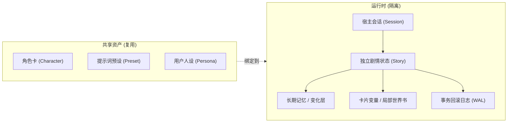

<div align="center">

# dsh-liketavern

**在 DeepSeek Harness 的 `dsh web` 中使用角色卡、世界书与长期记忆，开启 Tavern 式角色扮演。**

[](https://github.com/Amakurai/dsh-liketavern/releases/tag/v0.4.0)
[](https://deepseek-harness.github.io/deepseek-harness/)
[](https://nodejs.org/)
[](./LICENSE)

中文 | [English](./README.en.md)

[功能特性](#功能特性) · [核心概念](#核心概念) · [安装与升级](#安装与升级) · [快速上手](#快速上手) · [日常使用](#日常使用)

[兼容范围](#兼容范围) · [数据与备份](#数据与备份) · [常见问题与诊断](#常见问题与诊断) · [文档指南](#文档指南) · [开发与调试](#开发与调试) · [参与贡献](#参与贡献)

</div>

---

**dsh-liketavern** 是为 [DeepSeek Harness](https://github.com/deepseek-ai/deepseek-harness)（简称 dsh）打造的角色扮演插件。你可以直接导入 SillyTavern（简称 ST）规范的角色卡和提示词预设，在 dsh 原生环境中管理设定、推进剧情、分支出行和无损回滚。

- **宿主负责**：模型接入、长上下文聊天历史、工具调度与 Agent 运行时。
- **插件负责**：角色资产管理、ST 预设与提示词组装、剧情状态隔离（记忆/世界状态/变量）、交互卡与脚本沙箱。
- **开箱即用**：内置 EJS 模板引擎、酒馆助手接口子集、原生 MVU 支持；界面默认跟随宿主语言。

> 💡 **第一次使用？** 建议先阅读[环境要求与安装](#安装与升级)并跟随[快速上手 5 步走](#快速上手)体验第一场对话；若需迁移现有 ST 资产，请先核对[核心概念](#核心概念)与[兼容范围](#兼容范围)。

---

## 功能特性

| 模块 | 特性与能力支持 |
| :--- | :--- |
| **🎭 角色卡与人设** | • 导入/导出 V1、V2、V3 规范的 PNG 与 JSON 角色卡<br>• 支持多开场白切换、内嵌世界书、卡内正则与 HTML 交互卡面<br>• 可恢复的收纳箱与防误删引用保护；人设提供全局/会话级 `{{user}}` 身份定义 |
| **📖 世界书与世界状态** | • 全局、角色专属、当前会话私有三级世界书体系<br>• 关键词触发（次要关键词/反向排除/逻辑与或）、常驻条目与递归扫描<br>• 剧情变化层（Delta Layer）自动记录设定在剧情中的新增、变更与失效 |
| **🧠 智能长期记忆** | • 基于 BM25 检索与时间衰减权重，模型在对话中按需自主读写<br>• 容量超限时在后台空闲期自动摘要压缩，并完整保留可溯源的原始归档 |
| **🌿 剧情分支与无损回滚** | • 重新生成、修改 AI 发言或回退时自动创建独立子会话<br>• 自动撤销未继承楼层的记忆、变量等剧情状态，原始会话与历史分支完好无损 |
| **⚡ EJS 模板引擎** | • 内置沙箱执行条件、循环、异步宏与装饰器<br>• 支持剧情/消息级变量、JSON/YAML 初值、JSON Patch、Zod、Lodash、Faker |
| **📦 交互卡与脚本沙箱** | • 严格隔离的 iframe 卡面沙箱，支持三类脚本库（全局/预设/角色）<br>• 剧情变量自动持久化，支持同页剧情事件、世界书读写与消息局部刷新 |
| **🔄 原生 MVU 支持** | • 可选自动初始化与回复收口后的变量更新执行器<br>• 更新任务失败保留重试队列；兼容角色展示正则声明的状态栏占位符 |
| **🛠️ 模型工具与辅助生成** | • 7 个专用 PTC 工具（记忆检索/写入/更新、世界书按条读取、世界状态更新、资产列表/读取）<br>• 支持 AI 代答（生成用户发言并一键复制）与沿上下文继续生成 |

> 🧩 **智能工具调用**：角色扮演默认直接流畅回复；仅在缺失关键设定或需要固化重要剧情事实时，模型才会精准调用工具，兼顾沉浸感与长期一致性。

---

## 核心概念

在开始使用前，了解以下核心概念有助于更好地理解插件的运作机制：



| 概念 | 说明与边界 |
| :--- | :--- |
| **Tavern 模式** | dsh 的专用会话预设，用于激活本插件的角色扮演 Agent 运行时。新建会话时选择即可开启。 |
| **提示词预设** | 在「Tavern → 预设」中管理的 ST 提示词模板与结构配置。可绑定到会话，也可直接使用内置默认预设。 |
| **角色卡 vs 人设** | **角色卡**定义 AI 扮演的角色身份与背景；**人设**定义你在故事中的身份，并为提示词提供 `{{user}}` 的姓名与设定。 |
| **世界书 / 记忆 / 世界状态** | **世界书**提供静态世界观；**记忆**记录发生的剧情事实；**世界状态**动态维护世界设定在故事中的新增与失效。 |
| **会话 vs 剧情分支** | **会话**记录线性的聊天消息；**剧情**保存插件内部的记忆、变量与状态。重新生成等操作会派生出子会话与独立子剧情。 |
| **原生 MVU** | Model-View-Update 变量更新框架。插件内置了安全的轻量执行器，支持依赖数据流驱动的复杂角色卡。 |

---

## 安装与升级

### 环境要求

| 依赖项 | 最低要求 | 说明 |
| :--- | :--- | :--- |
| **Node.js** | `≥ 24.0.0` | 开发与 CI 环境均基于 Node 24 |
| **dsh CLI / 宿主** | **`0.1.7-rc.2`** | 插件的宿主 Peer 依赖锁定此版本 |
| **pnpm** | 任意主流版本 | 用于 `dsh plugin` 自动拉取与管理依赖 |
| **模型配置** | 已在 dsh 中完成配置 | 确保在宿主中可以正常发起对话 |

> 📌 首次接触 dsh？建议先查阅 [DeepSeek Harness 官方文档](https://deepseek-harness.github.io/deepseek-harness/)，运行一次 `dsh web` 完成基础配置。

---

### 方式一：通过 dsh plugin 安装（推荐）

在终端中执行以下命令，固定安装到最新稳定标签：

```bash
# 1. 添加插件到 web profile
dsh plugin --profile web add github:Amakurai/dsh-liketavern#v0.4.0

# 2. 检查安装状态
dsh plugin --profile web list --depth 0

# 3. 启动 dsh web（若已在运行，请先停止再启动）
dsh web
```

*本仓库已包含预编译的 `lib/` 产物，无需本地配置 TypeScript 构建环境。*

---

### 方式二：通过 Release 安装包（离线环境）

1. 从 [v0.4.0 Release](https://github.com/Amakurai/dsh-liketavern/releases/tag/v0.4.0) 下载 `dsh-liketavern-0.4.0.tgz`（发布页附带 `SHA256SUMS.txt` 校验和）。
2. 在压缩包所在目录执行：

```bash
dsh plugin --profile web add ./dsh-liketavern-0.4.0.tgz
dsh web
```

---

### 检查与升级

- **图形界面检查**：在 dsh 内打开 **「设置 → Tavern → 关于」**，可查看当前版本并一键检测 GitHub 最新发布。
- **执行升级**：核对 [更新日志](./CHANGELOG.md) 中的兼容说明，备份数据后，在终端运行新版本的 `dsh plugin add` 命令并重启 `dsh web`。
- 升级过程会自动沿用现有数据目录（详见[数据与备份](#数据与备份)）。

---

## 快速上手

只需要 5 步，即可体验完整的 Tavern 角色扮演：

```text
  1. 导入角色卡    ➔    2. 新建会话    ➔    3. 配置设定    ➔    4. 开始对话    ➔    5. 探索分支
(PNG / JSON 导入)   (选择 Tavern 模式)   (绑定预设/世界书)     (切换开场白)     (重试/回退/代答)
```

1. **准备角色卡**
   进入「设置 → Tavern → 角色」，点击「导入角色」选择 PNG 或 JSON 文件。系统会展示**静态兼容性检查报告**，确认后即可保存。
2. **新建剧情会话**
   点击新建会话，选择 **「Tavern 模式」**，在弹出的列表中点选刚刚导入的角色卡。
3. **确认会话设定**
   点击会话顶部的**角色入口**，可为当前会话单独微调提示词预设、人设或附加世界书（初次体验保持默认即可）。
4. **选择开场白并开局**
   若角色卡包含多条开场白，使用左右箭头 `‹ ›` 挑选心仪的开局，点击「开始对话」并发送第一句台词。
5. **自由调整与分支探索**
   对 AI 的回答不满意？使用消息右侧的操作栏：
   - 🔄 **重新生成 / ✏️ 编辑**：自动创建独立时间线分支，随时通过 `‹ n/m ›` 在多条分支间无缝切换。
   - ⏩ **继续生成**：让 AI 顺着当前文本继续扩写。
   - 🎭 **AI 代答**：让 AI 替你构思下一句回应（自动复制到剪贴板）。

> 🔍 **调试提示词**：第一轮对话完成后，可点击会话顶部角色入口的 **「提示词预览 → 最近请求」**，查看实际发送给模型的完整请求结构与上下文。

---

## 日常使用

### 配置入口与生效范围

| 操作目标 | 推荐入口 | 生效范围与机制 |
| :--- | :--- | :--- |
| **全局资产管理**（角色/预设/世界书/人设） | `设置 → Tavern → 各管理页` | **全局共享资产**：修改后在所有引用该资产的新老会话后续轮次生效 |
| **新会话默认模板** | `设置 → Tavern → 设置 → 默认配置` | **全局默认值**：仅在新会话初次点选角色时套用，已有会话不受影响 |
| **当前会话专属设定**（预设/人设/作者注释） | `会话顶部角色卡入口` | **当前会话**：修改仅对本条剧情后续轮次生效 |
| **当前剧情独占世界书** | `会话顶部角色卡入口 → 编辑本会话世界书` | **当前剧情私有**：随分支独立复制与回滚，不污染全局世界书 |
| **查看与修订剧情记忆** | `会话顶部入口 → 记忆` 或 `Tavern → 记忆` | **所选剧情**：选择具体剧情修改即时生效；选择「初始状态」仅影响未来新剧情 |
| **正则表达式与脚本配置** | `Tavern → 正则` / `Tavern → 设置 → 脚本` | 按所选作用域（全局 / 预设 / 角色）生效 |
| **提示词与世界书命中检查** | `会话顶部角色卡入口 → 提示词预览` | **只读查看**：检查当前轮次的实际组装结果与命中条目 |

> 🌐 **多语言界面**：插件界面语言默认跟随 dsh 宿主；你也可以在「Tavern → 设置 → 界面 → 界面语言」中手动固定为中文或 English。

---

### 剧情分支与回滚机制

不同于传统单线对话，dsh-liketavern 具备**细粒度的状态快照与回滚隔离能力**：

```text
[主线剧情] ─── 第 1 轮 ─── 第 2 轮（获得钥匙） ─── 第 3 轮（开启大门）
                                  │
                                  └── [重新生成第 2 轮] ─── 分支 2（钥匙断裂，记忆自动回滚）
```

- **分支安全**：在第 2 轮重新生成时，插件会自动建立独立子会话，并撤销第 2 轮之后产生的所有派生记忆与世界状态。
- **互不干扰**：主线依然保留「获得钥匙」的事实，分支 2 则拥有全新的剧情状态，两者独立演进。
- **编辑 AI 回复**：同样会安全切入新分支，撤销该楼层后的派生事实，等待你继续交互或手动调整。

---

## 兼容范围

### 第三方卡片、模板与脚本

- **酒馆助手（Tavern Helper）**：已支持变量存储、脚本库加载、世界书读写及主要消息操作接口。部分高级功能（如 `generateRaw`、跨页面事件广播）正在逐步适配中。详情请查阅 [酒馆助手兼容说明](https://github.com/Amakurai/dsh-liketavern/blob/main/docs/TAVERN_HELPER.md)。
- **EJS 提示词模板**：原生内置，兼容常见的 ST 模板表达式，无需额外安装扩展插件。详见 [提示词模板说明](https://github.com/Amakurai/dsh-liketavern/blob/main/docs/PROMPT_TEMPLATES.md)。
- **渲染安全与 Markdown**：全面采用 `markdown-it` 替代存在安全风险的历史解析器。HTML 交互卡面运行在严格的 `sandbox` iframe 中，阻止主页面 DOM 与敏感接口逃逸。
- **原生 MVU 支持**：支持纯官方规范的 MVU 导入与原生执行；自定义框架保留原代码运行。

---

### 提示词与采样机制

| 项目 | 实际处理机制 |
| :--- | :--- |
| **采样参数** | 支持 `temperature`、`maxTokens`、`stop` 及模型公布的思考档位（`reasoningEffort`）。`top_p` 与各类惩罚项做记录与友好提示。 |
| **预设位置投影** | DeepSeek API-key 官方通道按冻结布局投影预设；Messages 不支持的中途 system 位置合并到首条并显示兼容说明，相邻同角色消息可能合并。DeepSeek 账号通道与其他通道沿用 standing/turn 两段映射。 |
| **动态宏与格式** | 完整支持 `wi_format`、`scenario_format`、`personality_format` 以及 `{{lastmessage}}`、`{{charPrompt}}` 等常用宏。 |
| **PTC 工具调用** | 基于 dsh 原生程序化工具调用（PTC），支持单次多工具组合执行与并发查询。写入操作受当前剧情的楼层事务锁保护。 |

---

## 数据与备份

### 数据存储架构

所有插件数据均存放在 `$DSH_HOME/dsh-tavern/`（默认路径为 `~/.dsh/dsh-tavern/`，Windows 下为 `%USERPROFILE%\.dsh\dsh-tavern\`）：

```text
$DSH_HOME/dsh-tavern/
├── characters/         # 角色卡元数据与私有资产
├── presets/            # 提示词预设
├── lorebooks/          # 全局与角色世界书
├── personas/           # 用户人设
├── stories/            # 独立剧情数据（记忆、变量、WAL 日志）
└── editor-drafts/      # 未保存编辑草稿暂存
```

> 🛡️ **核心原则：角色资产共享，剧情状态隔离。** 每个故事和分支都拥有专属的状态存储与写前日志（WAL），多分支间绝不相互污染。

---

### 备份方式对比

| 备份类型 | 涵盖范围 | 适用场景与限制 |
| :--- | :--- | :--- |
| **📱 交互卡变量导出** | 当前剧情的持久化变量（上限 1 MiB） | 在「设置 → 卡片与数据」导出/导入，用于单卡状态存档与迁移 |
| **📝 编辑器草稿暂存** | 角色、预设、世界书等未保存的编辑内容 | 浏览器异常关闭后重开编辑器自动提示恢复（单份上限 2 MiB） |
| **💾 可校验全量目录备份** | 完整的插件数据、宿主会话与配置清单（带 SHA-256） | **推荐**。使用 CLI 工具创建，支持离线完整迁移与数据校验 |

---

### 命令行备份与恢复

在插件目录或安装环境中，提供了可靠的备份与恢复 CLI 工具：

```bash
# 1. 创建完整备份（--offline 声明停止写入）
node lib/backup.js create --home "C:/data/dsh-home" --backup "D:/backups/dsh-2026-09-19" --offline

# 2. 校验备份文件完整性与结构合法性
node lib/backup.js verify --backup "D:/backups/dsh-2026-09-19"

# 3. 恢复到指定的新目录
node lib/backup.js restore --backup "D:/backups/dsh-2026-09-19" --target "C:/data/dsh-restored" --offline
```

*若全局安装了工具，可直接使用 `dsh-tavern-backup` 命令代替 `node lib/backup.js`。*

---

## 常见问题与诊断

### 常见问题排查

<details>
<summary><b>Q1: 安装后在新建会话中找不到「Tavern 模式」或设置入口？</b></summary>

1. 执行 `dsh --version` 确认宿主版本是否为 `0.1.7-rc.2`。
2. 执行 `dsh plugin --profile web list --depth 0` 确认插件已正确安装到 `web` profile。
3. 重启 `dsh web`，并检查启动终端中是否有插件加载异常报错。
</details>

<details>
<summary><b>Q2: 修改了默认预设，但当前正在进行的对话没有变化？</b></summary>

「默认配置」仅在**新会话初次选择角色**时自动套用。正在进行的会话请直接点击**会话顶部角色入口**进行修改并保存。
</details>

<details>
<summary><b>Q3: 卡面渲染正常，但交互按钮、脚本或 MVU 不响应？</b></summary>

1. 确认卡片管理中已开启「允许交互式卡面」。
2. 进入「设置 → Tavern → 脚本」，检查对应脚本及所属文件夹是否处于**启用**状态。
3. 若需 MVU 自动更新，需在当前会话角色配置中勾选「启用原生 MVU 自动更新」并保持页面在前台。
</details>

<details>
<summary><b>Q4: 记忆页面为空，或者修改记忆后当前剧情没有反应？</b></summary>

1. 确认记忆管理页顶部选择的角色和剧情是否匹配。
2. 若选择了「初始状态」，修改仅对未来新建的剧情生效。
3. 长期记忆由模型根据对话自主提取写入或手动添加，不会机械复制全部聊天记录。
</details>

<details>
<summary><b>Q5: 提示词预览中的内容与模型实际表现似乎不一致？</b></summary>

请在提示词预览中查看 **「最近请求」** 标签页，这是上一轮实际捕获的入模数据；其他标签页为静态 ST 模拟运算，仅供参考。
</details>

---

### 一键只读诊断

当遇到难以排查的异常时，可在终端运行只读诊断工具，快速获取环境状态与问题码（**绝不输出任何隐私数据、路径或正文**）：

```bash
# 线上安装环境运行
dsh plugin --profile web exec dsh-tavern-doctor

# 输出结构化 JSON
dsh plugin --profile web exec dsh-tavern-doctor --json
```

---

## 文档指南

更多进阶指南与底层架构设计文档（推荐卡片作者与开发者查阅）：

| 文档分类 | 内容说明 | 链接 |
| :--- | :--- | :--- |
| **版本记录** | 版本更新历程与宿主要求 | [CHANGELOG.md](./CHANGELOG.md) |
| **接口兼容** | 卡面、脚本、变量、世界书与 MVU API 详述 | [酒馆助手兼容说明](https://github.com/Amakurai/dsh-liketavern/blob/main/docs/TAVERN_HELPER.md) |
| **模板进阶** | EJS 模板语法、宏变量与世界书装饰器 | [提示词模板说明](https://github.com/Amakurai/dsh-liketavern/blob/main/docs/PROMPT_TEMPLATES.md) |
| **适配进度** | 接口覆盖率清单与验收标准 | [酒馆助手适配进度](https://github.com/Amakurai/dsh-liketavern/blob/main/docs/TAVERN_HELPER_INTEGRATION.md) · [ST 模板审计](https://github.com/Amakurai/dsh-liketavern/blob/main/docs/ST_COMPATIBILITY_AUDIT.md) |
| **系统架构** | 剧情隔离、事务 WAL、提示词投影与记忆管线 | [架构设计说明](https://github.com/Amakurai/dsh-liketavern/blob/main/docs/ARCHITECTURE.md) |
| **宿主兼容** | dsh 版本行为矩阵与 UI 冒烟测试清单 | [宿主兼容记录](https://github.com/Amakurai/dsh-liketavern/blob/main/docs/HOST_COMPATIBILITY.md) |
| **安全审计** | 依赖漏洞管理、沙箱边界与隔离机制 | [依赖安全记录](https://github.com/Amakurai/dsh-liketavern/blob/main/docs/DEPENDENCY_SECURITY.md) |
| **发布与规范** | 代码规范、测试契约与发布审核流程 | [开发约定](https://github.com/Amakurai/dsh-liketavern/blob/main/AGENTS.md) · [发布包审核指南](https://github.com/Amakurai/dsh-liketavern/blob/main/docs/RELEASING.md) |

---

## 开发与调试

### 本地构建与验证

项目采用 TypeScript ESM（NodeNext）、React 18 与 Vitest：

```bash
# 1. 安装依赖
npm ci

# 2. 编译产物
npm run build

# 3. 运行完整测试套件 (150+ 测试套件)
npm test

# 4. 发布包完整性预检
npm run package:check
```

| 脚本命令 | 说明 |
| :--- | :--- |
| `npm run dev` | 使用本地 `cordis.patch.yml` 启动 dsh web 开发实例 |
| `npm run doctor` | 对当前 `DSH_HOME` 执行只读诊断 |
| `npm run doctor:check` | 验证诊断 CLI 的安装链接与 JSON 输出格式 |
| `npm run package:check` | 严格检查发布白名单与文档相对链接安全性 |

---

### 本地开发环境挂载

<details>
<summary><b>展开 Windows / macOS / Linux 本地挂载步骤</b></summary>

先运行一次 `dsh web` 初始化 profile 目录，然后将源码仓库目录链接至 `$DSH_HOME/profiles/node_modules/dsh-liketavern`：

```powershell
# Windows (PowerShell，在仓库根目录执行)
New-Item -ItemType Directory -Force -Path "$env:USERPROFILE\.dsh\profiles\node_modules" | Out-Null
New-Item -ItemType Junction -Path "$env:USERPROFILE\.dsh\profiles\node_modules\dsh-liketavern" -Target (Get-Location).Path
```

```bash
# macOS / Linux (在仓库根目录执行)
mkdir -p ~/.dsh/profiles/node_modules
ln -s "$(pwd)" ~/.dsh/profiles/node_modules/dsh-liketavern
```

挂载完成后运行 `npm run dev` 即可自动附加本地源码。每次修改 `src/` 后执行 `npm run build` 并重启开发实例即可查看效果。

</details>

---

### 目录结构概览

```text
src/
├── core/     # 纯函数层：提示词组装、世界书逻辑、正则引擎、BM25 检索与兼容解析
├── state/    # 文件存储层：角色资产、剧情隔离工作区、记忆持久化与 WAL 事务日志
├── node/     # 宿主编排层：生命周期配置、服务注册、请求投影管线与后台维护
├── client/   # 界面层：React 管理页面、会话操作栏、沙箱卡面与脚本宿主
├── index.ts  # 插件主入口 (Host Plugin Entry)
├── agent.ts  # Agent 运行时与工具装配入口
└── remote.ts # 前后端强类型 RPC 契约
```

---

## 参与贡献

### 问题反馈

若遇到问题，欢迎前往 [GitHub Issues](https://github.com/Amakurai/dsh-liketavern/issues) 提交反馈。为便于快速定位，请在描述中附带：

1. **运行环境**：插件版本、dsh 版本、Node.js 版本、操作系统与安装方式。
2. **复现步骤**：涉及的页面、操作顺序、预期表现与实际异常现象（可附带只读诊断输出）。
3. **最小复现样本**：脱敏后的角色卡或手写测试卡（若涉及第三方卡片特殊脚本）。
4. *提示：截图与日志请务必剔除 API Key、私人对话与个人敏感信息。*

### 代码与文档贡献

- 欢迎提交第三方卡片接口适配、Bug 修复、复现测试用例与文档纠错（如失效链接/勘误）PR。
- 涉及新特性或底层架构调整，请先在 Issue 中讨论设计方案与使用场景。
- 开始开发前请查阅 [开发约定](https://github.com/Amakurai/dsh-liketavern/blob/main/AGENTS.md)。
- 提交 PR 前请确保 `npm test` 与 `npm run package:check` 全项通过，并保持中英文文档同步。

---

## 开源协议

本项目采用 [MIT License](./LICENSE) 开源。
