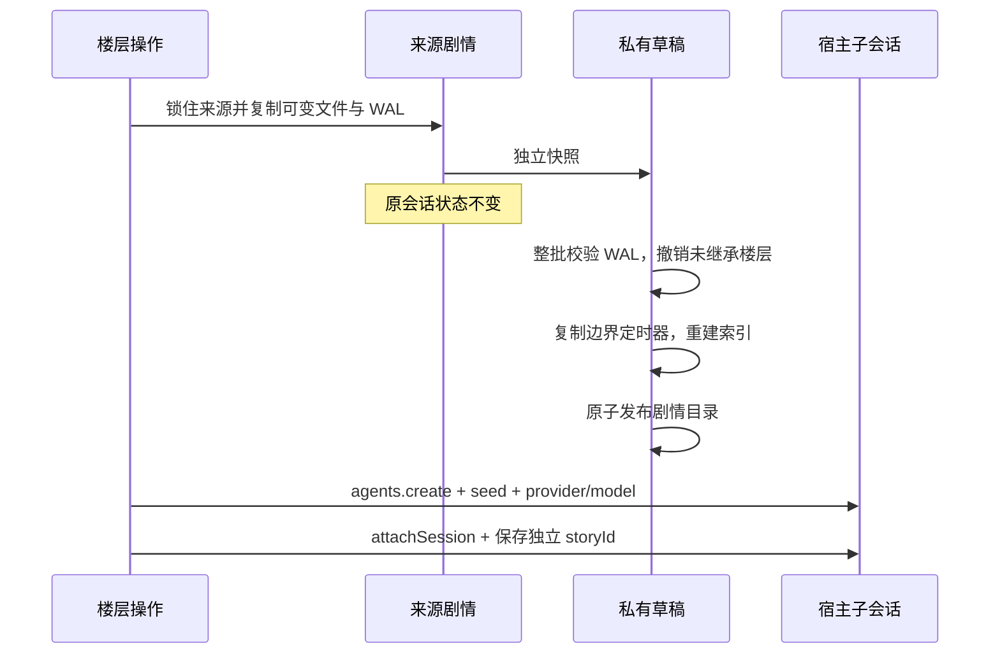

# 状态、提示词与故障边界

## 角色资产与剧情状态

角色卡是可复用设定。记忆、世界变化、笔记、聊天世界书和 WI 定时器是某条剧情的当前状态。两者不能共用一个可变工作区，否则重新生成会修改原会话，而兄弟分支会读到彼此的事实。

```text
$DSH_HOME/dsh-tavern/characters/<cardId>/
  card.json / card.png / assets/character-book.json / assets/regex-scripts.json
  memory/ / journal.md / state/ / assets/chat-lorebook.json  # 新会话初始状态
  stories/<storyId>/
    story.json                          # 所属 sessionId、创建时间、迁移标识
    memory/ / memory/archive/           # 活跃事实与来源原文
    journal.md / assets/chat-lorebook.json
    state/world-delta.jsonl / state/wi-timers/ / state/wal/
    index.json                          # 可重建索引
```

绑定的 storyId 由 host 管理，客户端不能通过 setSessionBinding 接管其它会话的状态。新会话复制初始状态，之后独立演进；面板的“初始状态”只影响未来新建的会话。记忆面板选择角色后再选择剧情，所有写请求显式携带该 storyId。角色卡、预设和全局/角色世界书仍是共享资产，编辑会影响使用它们的剧情的下一轮。

旧版无 storyId 的绑定首次加载时，复制当前角色工作区的可变数据到稳定的 legacy ID，保留原文件与来源 WAL。迁移幂等。旧版已经混合的事实、缺失的 WAL 或早先已经撤销的数据，不能可靠重建成各分支原本的状态；应在迁移后按会话核对，必要时手动修订。迁移不是历史修复算法。

## 分支与回滚



重新生成/编辑用户输入撤销目标层及以后。回退到某层保留该层。编辑 assistant 保留修改后的正文，但撤销该层及以后由旧正文产生的事实和定时器；不调用模型猜测新事实，也不自动续跑。需要的新状态由下一轮工具或面板建立。

每次写入的 before/after 镜像先原子落 WAL，正文随后原子替换。回滚先验证所有目标日志，不接受损坏 JSON、非法路径、序号或编码。旧共享 WAL 中若仍有同一文件的后继依赖，拒绝越过它撤销，防止撤销后继时复活已取消事实；世界变化层按 id 判断依赖。

回滚的 pending 操作和游标持久化到 rollback-progress.json。恢复时文件已是目标值则推进；仍是原值则完成替换；第三方又修改过则停止并报告冲突。每一步都可重试，不能把“部分成功”标记成完整回滚。分支回滚在草稿内进行，失败不会修改来源或公布半成品。

锁覆盖整个读改写和多文件快照，是进程内锁。同一数据目录不支持多个宿主进程并发写。文件化快照用空间换隔离，磁盘占用随剧情与归档增长；当前没有自动清理历史剧情，也没有跨进程事务。

## 记忆维护

辅助模型流必须正常 stop，并在 60 秒内完整返回；error、aborted、max-tokens、缺终止帧和空正文都不能归档。提交摘要前复核来源未变，先写摘要再归档原文。失败保留 pending，下一个已完成轮次的 idle 再尝试，同轮不会因维护自身的 idle 事件反复请求模型。

摘要可能遗漏事实，不能称为无损压缩。BM25 搜索同时索引活跃摘要可达的归档来源，结果含归档标识与可读取路径；模型可按条读取原文。只索引可达来源，不扫描所有旧归档；上限 10000 个可达条目，超过时明确报错。去重只查活跃条目，避免让模型更新已归档条目。检索输出仍受 topK 和 token 预算限制。

源楼层回滚时递归展开受影响摘要，再撤销原事实。手动修改的摘要按既有保留人工修订语义处理。归档保留原文，不保证自动摘要本身与原文语义等价。

## 提示词通道和诊断

| 数据 | 实际路径 |
| --- | --- |
| 角色定义、稳定预设、确定常驻 WI、静态深度注入 | system 段 tavern:standing，工具说明之后 |
| 本轮宏、触发 WI、记忆、世界变化、AN、笔记 | runtime context tavern:turn |
| 历史消息、图片、工具调用、工具结果 | 宿主 deriveMessages 与 agent-loop |
| ST 深度插入、历史正则、历史裁剪 | ST 模拟序列与辅助代答 |

live standing 在模拟预算裁剪前构造，历史增长不再导致角色定义被裁掉并钉死。只有确定常驻条目可进 standing：概率、组竞争、sticky/cooldown/delay、递归门槛或本轮宏都走 turn；probability=0 必须尊重。插件通道有独立体积检查，宿主历史/system/tools 的最终窗口与压缩由宿主负责，模拟 token 数不能代替实际请求计量。

每轮首次成功组装冻结完整计划与 standing 指纹，后续 step 每次重放同样的通道。设置、资产与时钟中途变化下一轮生效。失败不发布计划、不提交 WI 定时器，也不静默改成缺设定的请求。工具同轮写入通过 notice 确认，下一轮才重新检索。

当前 dsh 深度冻结 GenerateOptions；agent/request 只变更采样，llm/stream 的 next() 不接收替换消息。因此 live 不改写历史。新正则默认 output/render；input/send、prompt/assemble、prompt/send 明示为模拟与代答用途，不假装已经影响普通会话的入模消息。

“最近宿主请求”通过 llm/stream 只读捕获适配器转换前的请求，包含实际 system/messages/tools 和采样。内存只保留八个会话各一份，单份最多 2 MiB 字符，截断明示；不落盘，重启/淘汰后不可用。它不是供应商最终 HTTP 包，适配器之后的转换仍需看供应商日志。其他预览页签是重新计算的 ST 模拟。

## 第三方计算与类型检查

WI 正则、提示词组装和 output/render 正则都在 Node worker 内运行。每次计算上限 1 秒，启动上限 10 秒；最多两个并行、十六个等待任务，输入/输出各上限 16 MiB 字符，worker 老生代上限 128 MiB。超时/超量明确失败并终止 worker；静态 regex 检查不作为最终安全保证。Node 24 源码测试映射本项目相对 .js 导入到 .ts；发布运行只加载 lib JavaScript。

remote 的方法键集合、请求 schema、结果表、service 和客户端映射由编译约束。React 与宿主 primitives 使用真实公开类型，运行 bundle 保持 external，不使用 any 声明掩盖错误。

关键测试：storyIsolation（真实存储与宿主分支）、transactionRecovery（故障注入与来源）、robustBoundaries（真实 worker 和终止协议）、pipelineCache（同轮冻结）、floorConcurrency（工具事务）。这些测试不调用真实模型；宿主 UI 与实际安装仍需要另做冒烟。
