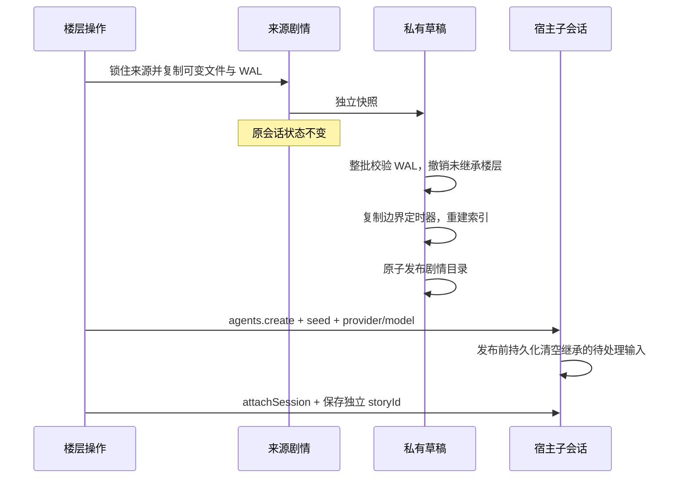

# 状态、提示词与故障边界

## 角色资产与剧情状态

角色卡是可复用设定。记忆、世界变化、笔记、聊天世界书和 WI 定时器是某条剧情的当前状态。两者不能共用一个可变工作区，否则重新生成会修改原会话，而兄弟分支会读到彼此的事实。

```text
$DSH_HOME/dsh-tavern/characters/<cardId>/
  card.json / card.png / assets/character-book.json / assets/regex-scripts.json
  memory/ / journal.md / state/ / assets/chat-lorebook.json  # 新会话初始状态
  stories/<storyId>/
    story.json                          # 所属 sessionId、创建时间、迁移标识
    memory/ / memory/archive/           # 活跃事实与来源原文
    memory/aliases.json                 # 检索别名（派生，可重建；不记 WAL）
    journal.md / assets/chat-lorebook.json
    state/world-delta.jsonl / state/wi-timers/ / state/wal/
    index.json                          # 可重建索引
```

绑定的 storyId 由 host 管理，客户端不能通过 setSessionBinding 接管其它会话的状态。新会话复制初始状态，之后独立演进；面板的“初始状态”只影响未来新建的会话。记忆面板选择角色后再选择剧情，所有写请求显式携带该 storyId。角色卡、预设和全局/角色世界书仍是共享资产，编辑会影响使用它们的剧情的下一轮。

预设与库世界书的版本编辑按读取返回的实际文件 ID 定位，不能按内部名称重新寻找导入槽位；修订不匹配或原目标删除时明确拒绝，不另建副本。库世界书导出条目缺少 name 时保留该文件原内部名称。未携带编辑修订的导入继续按资产身份处理净化冲突，空修订的创建拒绝覆盖既有资产。角色删除时抢救内嵌世界书单独选择空路径，在同一资产锁内创建副本，不走同身份替换。

旧版无 storyId 的绑定首次加载时，复制当前角色工作区的可变数据到稳定的 legacy ID，保留原文件与来源 WAL。迁移幂等。旧版已经混合的事实、缺失的 WAL 或早先已经撤销的数据，不能可靠重建成各分支原本的状态；应在迁移后按会话核对，必要时手动修订。迁移不是历史修复算法。

## 分支与回滚


```mermaid
sequenceDiagram
  participant UI as 楼层操作
  participant S as 来源剧情
  participant D as 私有草稿
  participant H as 宿主子会话
  UI->>S: 锁住来源并复制可变文件与 WAL
  S->>D: 独立快照
  Note over S: 原会话状态不变
  D->>D: 整批校验 WAL，撤销未继承楼层
  D->>D: 复制边界定时器，重建索引
  D->>D: 原子发布剧情目录
  UI->>H: agents.create + seed + provider/model
  H->>H: 发布前持久化清空继承的待处理输入
  UI->>H: attachSession + 保存独立 storyId
```

重新生成/编辑用户输入撤销目标层及以后。回退到某层保留该层。编辑 assistant 保留修改后的正文，但撤销该层及以后由旧正文产生的事实和定时器；不调用模型猜测新事实，也不自动续跑。需要的新状态由下一轮工具或面板建立。

会话日志还包含宿主的持久化输入队列。入队可能早于所选楼层边界，而消费发生在被丢弃的后续部分，不能仅截断消息就认为待处理输入也已清空。所有 Tavern 子会话在 `agents.create` 的 setup 内、挂载预设和发布前，调用子 agent 的公开 `inbox.clear()`，将 next-step 与 next-turn 的取消记录写入子日志；保留原历史序号及继承边界，来源会话不变。重新生成和编辑用户输入只在创建完成后显式提交一次目标输入。重放子日志也必须得到空继承队列；已有旧分支不自动改写，更新后可重新执行回退。

每次写入的 before/after 镜像先原子落 WAL，正文随后原子替换。beginFloor 只接受新楼层；已有楼层（含已提交或元数据缺失）拒绝覆盖，避免丢失原始回滚镜像。完成楼层的受控追加使用 reopenFloor 保留记录，重新生成须先回滚旧层。回滚先验证所有目标日志，不接受损坏 JSON、非法路径、序号或编码。旧共享 WAL 中若仍有同一文件的后继依赖，拒绝越过它撤销，防止撤销后继时复活已取消事实；世界变化层按 id 判断依赖。

回滚的 pending 操作和游标持久化到 rollback-progress.json。恢复时文件已是目标值则推进；仍是原值则完成替换；第三方又修改过则停止并报告冲突。每一步都可重试，不能把“部分成功”标记成完整回滚。分支回滚在草稿内进行，失败不会修改来源或公布半成品。

原子写入在目标同目录使用独立短名称 `.dsh-tavern-write.<uuid>.tmp`，不把临时后缀追加到合法长文件名上。独占创建成功后才拥有并清理临时文件；写入、同步或替换失败时保留最先发生的错误，收尾失败不覆盖它。替换成功即确认提交，不再让多余清理把已保存正文报告为失败。启动回收同时识别新短名称和旧目标名格式，仍受年龄、目录范围和链接边界限制。

锁覆盖整个读改写和多文件快照，是进程内锁。同一数据目录不支持多个宿主进程并发写。文件化快照用空间换隔离，磁盘占用随剧情与归档增长；当前没有自动清理历史剧情，也没有跨进程事务。

## 记忆维护

辅助模型流必须正常 stop，并在 60 秒内完整返回；error、aborted、max-tokens、缺终止帧和空正文都不能归档。提交摘要前复核来源未变，先写摘要再归档原文。失败保留 pending，下一个已完成轮次的 idle 再尝试，同轮不会因维护自身的 idle 事件反复请求模型。

摘要可能遗漏事实，不能称为无损压缩。BM25 搜索同时索引活跃摘要可达的归档来源，结果含归档标识与可读取路径；模型可按条读取原文。只索引可达来源，不扫描所有旧归档；上限 10000 个可达条目，超过时明确报错。去重只查活跃条目，避免让模型更新已归档条目。检索输出仍受 topK 和 token 预算限制。

bigram 表达不了单字词：「凛去哪了」与「凛的妹妹」没有共同 bigram，单独一个「樱」连 bigram 都切不出来。因此 CJK、假名、谚文的每个字另有一套倒排表，检索时符合条件的字作为半权重的单字词（keys 里的字同样按 2 倍词频计入），不计入文档长度，也不参与写入去重。判断的核心是这个字有没有「单独成词」的用法：左右两侧都是标点、段首段尾或虚词（「叫樱，」「凛的」），或者跟在引出名字的字后面再接标点（「绰号鲸，」）。依次判断：

- 被只有一个字的 key 声明过的字始终是主证据。名字正好是功能字（比如叫「七」）、极其常见、或者从没有单独成词地出现过时，靠这个检索；`tavern_memory_write` 的 keys 说明要求把单字的名字单独写成一项。
- 假名、功能字（`src/core/stopwords.ts`）以及被剔除的功能 bigram 里的字不用。
- 整个查询只由孤立的单字组成时（直接搜「樱」），其余条件不再检查。
- 出现在超过半数记忆里的字不用；库里不到二十条时不按这个比例排除——刚开始的剧情里主角的名字出现在大半条记忆里很正常。
- 主证据：库里某处单独成词过，并且在这段查询里至少一侧是边界。两边都要——库里的「礁门自开」不该让「几点开始」命中。
- 主证据的另一种情况：查询只有被虚词隔开的单个字（「豆在哪」「药呢」），除了这个字没有别的可查。这时库里的证据放宽为「一处开头、另一处收尾」（「豆抓伤过…」「流浪猫豆是…」），不必被同时夹住。代价是「我走了」「我信你」这类只有一个单字动词的输入，在库里恰好两种位置都有这个字时会带出弱命中。
- 次级证据：其余在库里或查询里单独成词过的字，以及能产的构词成分（左右邻接各不止一种，如「打听、打开」的「打」）。次级证据只给已经命中的文档加分，不单独带出命中：「樱的药还够吗」里的「药」能把同时提到樱和取药的那条顶上去，却不会带出「火药」。

查询里的功能词不参与评分；被单独写成 key 的除外。库不大时它们显得稀有，却只会带来偶然命中。被剔除的 bigram 完全不参与检索，连其中的字也不再单独作证据，所以判定故意很窄：列在表里的功能词（没有、知道、现在、起来）、两个相邻的核心虚词（我们、什么、不是）、结构助词或语气词挨着功能字（的人、了一）、数词接量词（两个、三次）。「两个字都在功能字表里」不构成剔除的理由——日向、五月、千里、和也、天使、上将、天才、自由都是这样的词；这类 bigram 多半是跨词的碎片（来一、里有），但分不清，所以保留、只按半权重计。英文功能词（the、is、not）同样剔除，但不收 will、may 这类同时是人名的词，也不收单个字母：it's、don't 的词尾在分词时就丢掉，M、T 先生、小 S 这样的名字照常检索。功能词表只在查询一侧使用，覆盖中文和英文；日文的功能词是假名，单个假名本来就不作单字词，假名 bigram 和韩文没有对应的表。

名字正好由功能字组成时有三条路让它照常检索：写成单字或单词的 key；角色卡的名字和用户人设的名字在自动入模时自动当作已声明的词（卡叫「七」、人设叫「月」不需要任何配置，人设叫「我」或功能词时不算）；`tavern_memory_search` 的检索词按字面对待，只搜一个字时功能字也照常匹配。

**检索别名。** 字面检索找不到换了说法的问法（问「谁在偷药」，记忆写的是「止痛剂少了两箱」）。补救是给记忆做文档扩展：一轮结束、会话空闲时，用当前会话模型为还没有别名的记忆各写几个别名——其中的名字（含单字名）、正文里没有的同义说法和所属类别、别人问起时会用的词。别名与 keys 一样参与匹配、不计入文档长度，只有一个字或一个词的别名同样把它声明为词，但词频按正文的 1 倍计。它走记忆压缩同一条空闲维护通道（`agent.runMaintenance`），不在对话轮次里增加请求：每次空闲只发一次辅助请求，压缩优先；每次最多处理 12 条，存量记忆分多次补完；只接受正常 stop 终止帧，截断、取消、出错都不保存，下一个结束的轮次再试；回复不合格式时这批记忆记为没有别名，不反复请求。设置项 `memory.aliasExpansion`（默认开）关闭后不再发送，已有别名继续生效。

别名是派生数据，存在 `memory/aliases.json`，按正文指纹对应到记忆：正文一改、或楼层回退把正文改回去，旧别名自动作废并重新生成；文件损坏或丢失只是退回没有别名。它不改记忆文件，只经无楼层的文件面写入、不记 WAL，分支快照随 memory 目录一并复制。别名只进检索索引，不进写入去重的索引，否则同一段正文会因为多出的词显得不那么相似。别名的质量取决于模型，没有办法在不调用模型的测试里衡量；测试只验证这条通道和它的失败边界。

仍然存在的边界：别名还没补上的那一两轮（刚写入的记忆要等这一轮结束后的空闲）、关闭了别名、或者模型没想到那种问法时，换说法的问法仍找不到，这时靠 keys 的说明（让模型写入时把同义说法也写成 key）和 `tavern_memory_search` 的提示（库里有记忆却没有匹配时，让模型换词重查或用 `tavern_asset_list` 看 memory 目录的摘要）。从没被标点或虚词夹住过、也不在 keys、别名、角色名里的单字名，放在带着别的实词又没有前文的短句里（「豆今天吃东西了吗」）问不到；试过把「句首的字」也放宽，20 句无关短句里会多一句误命中，没有采用。

自动入模的查询取最近 `queryMessages` 条消息。窗口里最后一条是用户输入、且前面还有别的内容时，这条输入里的词再加 4 倍得分（合计 5 倍）；续写、重新生成和只有一条输入时不加权，`tavern_memory_search` 也不加权。加权按命中分相加，不按排名融合：排名融合看不到命中强弱，闲聊输入偶然撞上的一个词就会把无关记忆排到场景记忆之前。

这些取值来自手写的开发评测集 `test/memoryRecallEval.fixture.ts`（52 条剧情记忆、56 个场景，另有加干扰项、常见单字名、小库、英文四种库）。只用 bigram、不加权时，基础库上首要期望进入前 5 的场景数为单字 0/14、焦点 6/7、前文 10/11、混合 2/4；现在各库全部通过，20 句无关短句里只有含被 key 声明的字的一句带出命中。规则是否只对开发集好看由留出集 `test/memoryRecallHoldout.fixture.ts` 检查：它在规则定稿后才写，首次运行为单字 7/9、焦点 6/6、前文 3/4、混合 3/3、无关短句 0/8 有命中、换说法 2/5。之后有两处规则是看着它的失败改的（功能 bigram 里的字不再单独匹配、只有孤立单字的查询放宽库内证据），单字现为 9/9，这一类已不能算独立检验；剩下的一个前文场景（期望的记忆与四百字的场景只共有一个词）和三句换说法的问法靠字面匹配解决不了，原样留在测试里。两份评测都只衡量词面检索，数字不代表真实剧情上的效果；`scripts/memory-retrieval-report.mjs` 可以在本机对真实剧情的记忆库输出同口径的汇总数字（只读，不打印正文）。

检索排序用 BM25：keys 每次出现按 2 倍词频计入，不计入文档长度。写入去重不用 BM25 原始分，而用 0–1 的相似度：查询与条目共有词的权重和，分别除以两边全部词的权重和，取较小值；词的权重是扣掉该条目自身后的 IDF，因此同一对文本在小库与大库得分一致。阈值 `dedupSimilarity` 默认 0.75，只拦几乎相同的正文；这是词面比较，换说法的同一事实与「长名字加短事件」的不同事实得分接近，无法靠阈值区分。

检索用的索引和解析结果都跨调用保留，每次使用前按磁盘指纹（文件名 + mtime + size）核对：活跃目录列一次，可达的归档来源批量取一次指纹（`WorkspaceFs.statMany`：父目录的链接检查只做一次，每个文件一次 lstat）。指纹变了的文件才重读，索引只增删变化的条目，不重新给全部正文分词；来源加载失败时上一份索引保持原样。同一层来源有界并行读取，并按来源顺序报告第一个故障。

同一剧情下可以同时有多个 `MemoryStore` 实例：管线和工具的只读操作用剧情句柄上长期存活的那个，工具写入每次新建一个带楼层的实例。`WorkspaceFs` 的每次写入和删除都按根目录记进写入登记（`src/state/writeLedger.ts`），各实例据此重读被写过的文件，不依赖 mtime 精度——同一时间刻度内把「北门已开」改成等长的「北门未开」也能发现。工具写入、面板编辑、归并归档和 WAL 回滚都经过 `WorkspaceFs`，所以都被覆盖。只有完全绕过它的改写（别的进程、外部编辑器）且修改时间与长度都不变时才发现不了，这时需要显式 `invalidate()`，它对同一剧情的全部实例生效。

来源遍历、循环检测与条数上限共用文件身份：Windows 大小写别名计作同一来源，条目保留原文件名，大小写敏感系统仍区分文件。归档删除中断留下活跃及归档副本时，以活跃正文为准，不沿摘要中的大小写别名复活旧事实。

三个写工具的主事实与派生资产目录分别确认：正文成功后索引刷新失败仍返回 ok=true、完整 id 和 indexUpdated=false，提示不要重写同一事实，并保留同轮成功 notice。容量统计在主写入前完成；压缩 pending 只在主事实成功后发布。真实主写入或 WAL 故障仍明确失败，不用派生刷新容错吞掉。

源楼层回滚时递归展开受影响摘要，再撤销原事实。手动修改的摘要按既有保留人工修订语义处理。归档保留原文，不保证自动摘要本身与原文语义等价。

来源 ID 与记忆文件名使用相同校验，支持中文、空格和点号。普通自动 ID 继续写 `compress:` / `merge:` 逗号列表；特殊文件名写 `compress-json:` / `merge-json:` JSON 字符串数组，避免文件名中的逗号被拆为多条来源。检索、人工修订和回滚共用解析规则，兼容已有无歧义的旧列表；损坏或越界的来源明确报错。旧版已经把含逗号文件名写成歧义列表的数据无法自动推断归属，新格式也不应交给只认识旧列表的插件版本处理。

## 提示词通道和诊断

| 数据 | 实际路径 |
| --- | --- |
| 历史前角色定义、稳定预设、确定常驻 WI、非零深度静态注入 | system 段 tavern:standing，工具说明之后 |
| 本轮宏、触发 WI、记忆、世界变化、AN、笔记、历史后条目与 depth=0 内容 | runtime context tavern:turn；历史后条目与 depth=0 保留尾部顺序 |
| 历史消息、图片、工具调用、工具结果 | 宿主 deriveMessages 与 agent-loop |
| DeepSeek API-key 官方通道的预设角色、顺序、深度与模板位置 | 同一 AgentLoop 的 Tavern 适配器，在原始 Message[] 上按冻结身份插入 |
| 历史正则、历史裁剪 | ST 模拟序列与辅助代答 |

live standing 在模拟预算裁剪前构造，历史增长不再导致角色定义被裁掉并钉死。只有确定常驻条目可进 standing：概率、组竞争、sticky/cooldown/delay、递归门槛或本轮宏都走 turn；probability=0 必须尊重。turn 层世界书受固定预算约束（默认 8192），被裁条目在快照尾部留 uid 清单，模型可按需补读。因此预算决定的是哪些条目完整注入：主键命中最新一条消息（玩家本句）的条目优先于作者 order，更早消息、递归或 sticky 带出的条目先退到清单。插件通道有独立体积检查，宿主历史/system/tools 的最终窗口与压缩由宿主负责，模拟 token 数不能代替实际请求计量。

每轮首次成功组装冻结完整计划与 standing 指纹，后续 step 每次重放同样的通道。设置、资产与时钟中途变化下一轮生效。失败不发布计划、不提交 WI 定时器，也不静默改成缺设定的请求。工具同轮写入通过 notice 确认，下一轮才重新检索。

本轮输入从 `agent/inbox/claimed` 追踪：宿主先发 turn/start，再认领 inbox，随后组装请求，user/message 要到准备完成后才持久化。认领与楼层收口共用会话队列，按当前 turn 校验；尚未认领的未来消息和图片不参与宏、世界书或模板快照。取消后保留于宿主队列的未认领输入，以及 MVU 延迟后归还队列的输入，在下一次认领时按原消息 ID 重新登记。

宿主对 runtime context 跨轮也按字节去重。有尾部指令的 live 计划加入固定本轮编号，使相同 PHI 每轮重新落在新输入后，同轮多步与恢复仍重放同一字节。卡级 main/jailbreak 覆盖在原启用槽位替换，保留角色、顺序与深度；原文只有被 `{{original}}` 引用时才求值。宏变量共用一次组装的顺序值表，另追踪动态来源与传递读取，禁止动态值进入跨轮 standing 钉位。导入采样按字段覆盖插件设置，并同样随整轮计划冻结。

角色覆盖额外受全局 `prompts.preferCharacterPrompt` / `preferCharacterInstructions` 控制，默认开启并计入 standing 指纹；不是 ST 预设字段。同 order 的 relative 条目按原栈稳定排列；深度条目按 order、assistant/user/system 顺序排列，来源仍独立保留以供隔离模板与正则处理，不提前合并不同来源正文。`system_prompt` 仅作为 ST 内建身份往返，与消息 role 分开。三个格式字段存于预设 formatting，正文在 worker 内展开；动态包装进入 turn，空串恢复原字段。

另保存结构化 `PromptLayout`，在 `agent/pre-step` 给接收批次末条 user/message 附加有界 `source.tavernPromptPlan` 元数据，保留原 ID、source.kind、角色与正文；仅在空批次时创建独立合成载体。元数据保存布局、轮次、会话身份和精确宿主段文本，不作为提示词文本发送。因此最终路由在 agent/request 改变时也可使用同一计划，无需提前猜路由。布局仅含已求值的插件内容与原始消息 ID，不复制经正则改写的历史。预设、世界书、GENERATE、INSERT 和延迟 outlet 的最终结果一起冻结。旧版本未完成轮缺少布局时继续完成旧映射，下一轮才切换。

`agent/request` 将已绑定会话的 `deepseek-official` 路由映射到 `tavern-deepseek`。自持有的公开 `DeepSeekAdapter` 复用已注册设置 namespace 的最终配置、凭证、附件、Files 与 API 扩展；`prepareCall` 委托保持同代连接事实，不另开模型请求或重复进入 llm/stream。适配器在副本中保留宿主工具系统前缀，移除 Tavern 两段内容，再按原角色与身份锚点插入布局条目。当前轮载体固定历史后边界，后续工具步骤不移动它；工具调用与结果不能被插入项拆开。历史锚点被合法摘要替代时，只映射至摘要边界，不恢复旧正文；任意丢失或不明来源拒绝。其它供应商路由暂使用上表的 standing/turn 映射。

请求钩子在异步等待后复核当前 turn、cardId、storyId 与冻结结果。绑定服务还在会话锁内完成身份和剧情归属校验后、实际发布变更前，同步调用宿主公开 cancel 并保留 inbox，封闭钩子之后 prepareCall 的等待窗口。旧楼层按原句柄收口；同剧情的预设和人设编辑不取消当前轮。保存比较严格区分临时 I/O 故障与缺失绑定，读盘不确定时拒绝保存，不能丢失 WAL 祖先或误判为换绑。

缓存优先布局（设置「缓存优先布局」，默认开启）随本轮计划冻结。开启时，本轮动态的历史前条目（触发世界书、记忆、变化层等）与全部深度注入都放在本轮输入之后，与原有历史后条目组成本轮尾块。尾块以 `turnTailHeader` 标题开头，与 tavern:turn 通道一致，标明其后是系统材料，而不是玩家台词。尾块中的 system 条目一律改用 user 发送。原因是：放在历史前的动态内容每轮都会变，深度位置也随历史增长而移动，都会让后面的整段历史失去 DeepSeek 前缀缓存。此外，中途 system 在 in-history 模型上会作为整份系统快照发送，在只支持首条 system 的模型上又会并回首条，同样破坏前缀。历史后 system 在 in-history 模型上本来就会每轮在尾部整份重发，产生不可缓存的重复。静态历史前条目保持原位置。历史轮尾块按各轮载体上冻结的计划，在原位置逐字节重放（同一构造、同一消息 ID 与顺序）。DeepSeek 的前缀缓存覆盖上一轮请求及其生成内容（思考、工具调用、回复）；若丢弃旧尾块，前缀会断在上一轮输入之后，其后的回复与工具结果每轮全价重付。实测单轮一次工具步骤的会话，下一轮只命中约 5k/24k。宿主历史中每轮的 runtime context 快照仍计入上下文压力，与重放体积相当，压缩判定不会被低估；载体被压缩后不再重放。关闭后按 ST 原位置投影；缺少该标记的旧计划也按原位置投影。

投影同时读取本次 `prepareCall` 冻结的模型能力。`systemPromptUpdate=in-history` 表示最新 system 完整生效，先合并相邻的 Tavern 系统条目，再使每条中途 system 包含宿主 SDK 和截至该位置的全部系统条目，不能只发送增量预设。合并不跨真实 user/assistant 或其它来源的 system。未声明该能力的模型只读首条 system，因此系统条目合并到首条并记录兼容诊断，user/assistant 的位置不变。完整快照在拼接前逐项计数，累计超过 16 MiB 明确拒绝，避免深度条目放大输出；逻辑布局和宿主历史均不被改写。DeepSeek Messages 协议还要求中途 system 位于 user/tool 之后、assistant 或结束之前；不满足时系统条目合并到首条并显示 `messages-system-layout` 诊断。供应商可能合并相邻同角色消息，因此该投影仍不是任意 ST 布局的有线等价物。实际请求可能比两段映射更长，诊断提供处理前后的文本估算和同代模型窗口；估算不含图片与工具编码，不替代供应商实际计量。

assistant 预设条目只存在于请求副本，携带 tavernProjection 标记，绝不写入持久 assistant/message 或伪造历史模型输出；末尾 assistant 不代表供应商专用 prefill/prefix，当前未实现该协议。代答仍使用独立的 system/history 请求，采用历史正则结果，不等同于模拟完整角色序列。

Tavern 模式经 `dsh-agent-preset-registry` 注册和撤销，不再生成 `.agent-presets` 文件。设置通过宿主 volatile Config 与 SettingsForms 更新当前 profile；固定 entry id `dsh-tavern` 让宿主可迁移旧 settings.yaml 的同名节。

Tavern 预设挂载官方 `dsh-agent-tool-presentation` 的 `mode: ptc`。七个业务工具由宿主生成 SDK，模型只直接调用 `run_code`；工具规范输出由 schema 验证。独立只读工具声明 `isConcurrencySafe`，可在同一程序内并行；写工具不声明并行，使用宿主独占屏障。依赖前项结果的操作依次 await，中间结果只有程序返回/打印的部分进入模型历史，子调用仍由宿主记录。步骤 notice 按模型 step 去重，不按 PTC 子调用累加；写入确认仍保留。模型编写的 PTC 程序使用宿主 `dsh-ptc-runtime-node` 的子进程运行时，第三方卡片/EJS 继续使用原有隔离边界，不能把第三方脚本转交 PTC 执行。

预设目录返回的 identifier 是完整存储身份。`tavern_asset_read({ presetIdentifier: identifier })` 精确读取该条目，保留空白，并允许 `list`、`catalog`、`*` 这样的合法同名条目。旧 `preset` 参数仍接受目录令牌，其它值先精确匹配、未命中才去除前后空白兼容查询；两个定位参数同时传入会明确拒绝。完整定位字段与输出仍共同遵守工具预算，不生成截断后的假身份。

PTC 程序的非空返回值必须为无损 JSON。工具原始短结果可直接返回；重组 SDK 可选字段时必须省略缺省项或使用 `?? null`，不能生成含 `undefined` 的对象/数组。外层 `invalid-output` 不会自动撤销已完成的子工具写入；写入确认仍有效，格式修复不得重做已经确认成功的操作，无回执时先只读核实。写入仍属于原楼层 WAL，可由正常楼层回滚撤销。该约定通过提示词引导并由宿主校验，不保证模型永不生成非法程序。

当前 dsh 深度冻结 GenerateOptions；agent/request 只变更路由和采样，llm/stream 的 next() 不接收替换消息。结构化预设由适配器转换实现，原始历史和冻结请求不被修改。新正则默认 output/render；input/send、prompt/assemble、prompt/send 仍为模拟与代答用途。

“最近请求”包含 system/messages/tools 和采样。普通路由在 llm/stream 只读记录（stage=host）；Tavern DeepSeek 路由用布局处理后的消息覆盖记录（stage=tavern-adapter）。内存只保留八个会话各一份，单份最多 2 MiB 字符，截断明示；重启/淘汰后不可用。这不是供应商最终 HTTP 包，工具与图片的有线编码仍由官方适配器处理；其他预览页签是重新计算的 ST 模拟。

## 第三方计算与类型检查

EJS 提示词模板在同一 worker 内另建 QuickJS/WASM 实例，只有复制的 JSON 输入与有界 JSON 输出，无 Node/DOM/网络桥。模板状态与已处理回复快照写在剧情 `state/template.json`，组装读改写共用工作区锁；分支复制此文件，WAL 回滚同步撤销。动态模板进 turn，不钉入 standing。正常 stop 回复在 turn/end 清理缓存、提交 WAL 前处理；UI 通过消息 seq 读取快照，预览和重绘不产生持久写入。详细接口及与 ST 的差异见 [模板说明](PROMPT_TEMPLATES.md)。

消息变量由宿主稳定 Message.id 定位，historyIdentities 与过滤后的文本历史严格对齐，消息 seq 仅用于展示定位。新输入与普通 stop 回复一次继承前序快照；withMsg 修改历史目标也归当前执行楼层的 WAL。冻结上下文只包含当前剧情可见的快照，旧单树不用于推断缺失历史。快照摘要与条件/schema 校验共同覆盖直接引用写入。

sticky 的 prompt、generate regex、message regex 分别在成功组装结束、成功组装结束、下一轮开始推进，缓存命中与预览不另行提交。prepared 期间 generation 保存单份执行日志，continuation 引用它；收口时仅为仍活跃的回调保留日志。阶段切换、消息元数据和回复操作一起重放，共享词法变量保留，旧增量仅发生于重建副本。预加载资产指纹与权威注册表阻止过期规则复活；最后一个回调到期后可释放旧日志。变量、消息快照、计时器、注册表与回执始终同文件提交。

世界书装饰器先归一化；@@if 在隔离 worker 内只读筛选后才参与 WI 分组和预算，命中的条件条目强制进入 turn。每次 QuickJS 建立时重建预加载函数与缓存默认值，不持久化预加载副作用；生成与回复沿用冻结资产。JSON Patch 在副本上验证整批操作后再调用统一变量写入，模板失败仍拒绝整个回复提交。

WI 扫描、预处理和组装由同一 worker 计划完成；activewi 新请求触发同轮重组，QuickJS 按来源缓存求值，所有迭代使用同一轮初定时器。动态正则只在 QuickJS 内执行；修改插件静态内容时移入 turn，历史改写只出现在模拟序列。跨阶段仅传递字符串回复规则，局部闭包在渲染前/预加载时重建。

模板依赖构建为 `lib/vendor/template-libraries.js`：Zod、Lodash、jsonrepair 只在 QuickJS 中求值，不桥接 Node 函数。库加载前先固定沙箱 Date/Math.random，避免 Lodash 捕获宿主时钟。变量 schema 在副本上完成校验与转换，失败不发布；成功写入记录校验后的状态指纹，导出不会再次运行非幂等转换，绕过 setter 的持久引用改动仍需通过校验。

Faker 构建为单独带许可证的 `lib/vendor/template-faker.js`。worker 只把脚本文本复制进 QuickJS，首次使用时由沙箱加载；全语言数据按需 JSON.parse，默认实例使用冻结 seed/now。角色读取快照包含 ST 根字段与 data 字段但不含 PNG/raw；普通 WI、渲染和预加载均提供 world_info，省略库名的嵌套读取保持当前条目来源。

变量变更时，生成计划把 WI 定时器一同提交到模板文件的可选 wiTimers 字段，消除两次 rename 之间的半提交。未迁移的会话继续读取旧 wi-timers 路径；已迁移会话的普通计时更新也只写模板文件。pendingTurnPlans 只暂存已组装但尚未提交的绝对快照，提交成功才发布正式 turnPlans，楼层结束时清理。分支将边界定时值写子会话旧路径，不修改复制的祖先模板文件；子会话首次变量更新再在自己的楼层内迁移。

定位条目由纯解析器识别，参与 WI 选择但从普通位置桶移出，避免重复注入。worker 在组装后处理 GENERATE 正文追加、@INJECT 位置/角色插入、@INJECT 正则插入，再检查总预算。精确定位仅修改模拟 messages 副本，真实内容追加到 tavern:turn，standing 与宿主历史保持其原有职责。重组重放定位来源缓存，正则目标通过正文指纹和重复次数识别，位置变化不会重复执行同一模板。

WI 正则、提示词组装和 output/render 正则都在 Node worker 内运行。每次计算上限 1 秒，启动上限 10 秒；最多两个并行、十六个等待任务，输入/输出各上限 16 MiB 字符，worker 老生代上限 128 MiB。超时/超量明确失败并终止 worker；静态 regex 检查不作为最终安全保证。Node 24 源码测试映射本项目相对 .js 导入到 .ts；发布运行只加载 lib JavaScript。

remote 的方法键集合、请求 schema、结果表、service 和客户端映射由编译约束。React 与宿主 primitives 使用真实公开类型，运行 bundle 保持 external，不使用 any 声明掩盖错误。

关键测试：storyIsolation（真实存储与宿主分支）、transactionRecovery（故障注入与来源）、robustBoundaries（真实 worker 和终止协议）、pipelineCache（同轮冻结）、floorConcurrency（工具事务）。这些测试不调用真实模型；宿主 UI 与实际安装仍需要另做冒烟。
